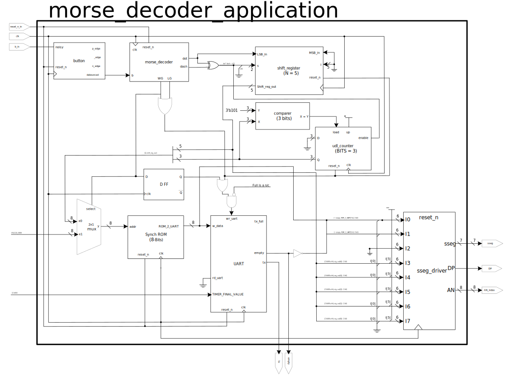
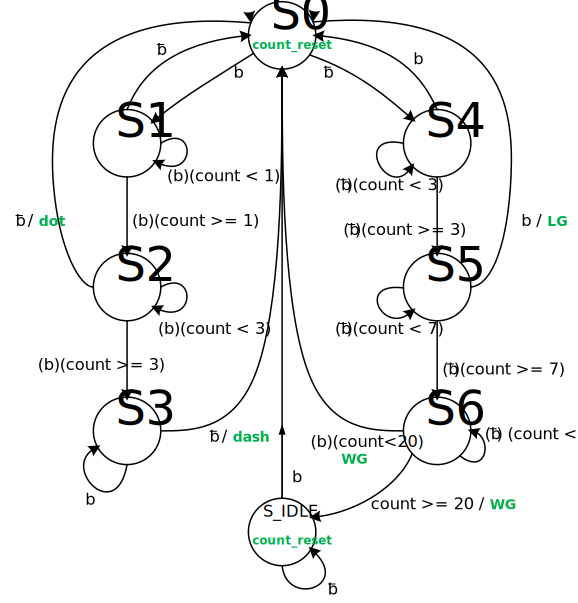
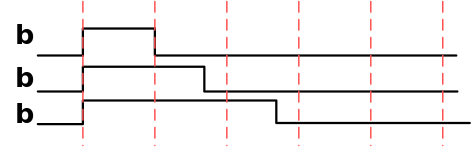
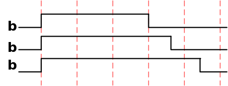
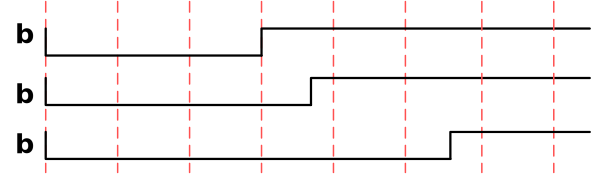
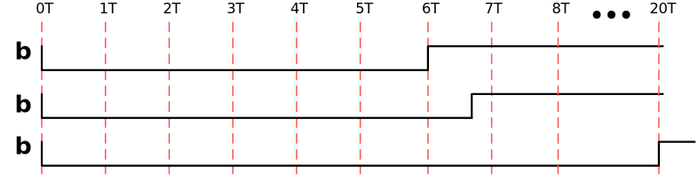
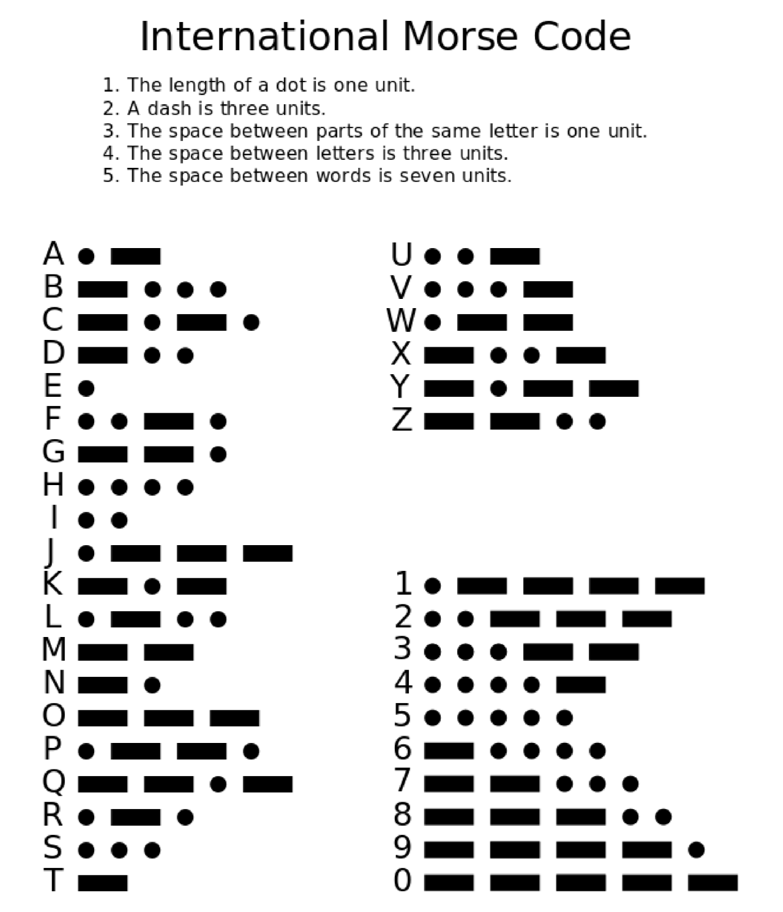

# Lab 12 - Morse Code to Terminal using UART
## Group 5: Steven Jmaev and Jacob Pollak
### Due Date: May 11, 2021

***
### Lab Goals and User Inputs:
This lab demonstrates a system which reads morse code, converts it to ASCII characters in hexadecimal format, and transmits these characters to a computer terminal ([PuTTY](https://www.putty.org/)) using the UART protocol.
The user must enter morse code (dots and dashes) using a single push button. The dot or dash inputs inputs will be registered as logic 0 or 1, respectively. The decoded hex morse-to-ASCII characters are shown on the seven segment displays prior to transmission. 

#### User Inputs
| Button Number | Variable Representation | Button Function | 
| -----------: | -----------: | -----------: |
| CPU_Reset (C12) |   reset_n | System Reset|
| BTND (P18) |   b | Morse Code Input  |

#### Seven Segment Display Output
| SSEG #0 | SSEG #1 | SSEG #2 | SSEG #3 | SSEG #4 | SSEG #5 | SSEG #6 | SSEG #7 |
| -----------: | -----------: | -----------: | -----------: | -----------: | -----------: | -----------: | -----------: |
| ASCII Hex Digit 1 | ASCII Hex Digit 0 | No Connect | 5th Previous Morse Input | 4th Previous Morse Input | 3rd Previous Morse Input | 2nd Previous Morse Input | Previous Morse Input |

### Accomplishments:
* We have fixed the issue of our morse decoder FSM so that it doesn't get stuck in an undesired state (). Our revised FSM no longer outputs a word gap (WG) at the start of the morse word.

### Future work: 
* This application could be used altered such that it performs an ASCII-to-Morse decoder. In other words, when we type a character on the computer terminal, it could read the ASCII, convert to Morse Code, and display the code on the seven segments. 
* The Nexys A7 FPGA board includes an audio out port. This port could be utilized to play the morse codes in an audio format. 

### Notes for future reference: 
* We have not used the `full` signal of the UART's TX port, since our fingers cannot create signals fast enough to fill up the 1024 words in the UART's TX FIFO buffer. If this board were connected to other high-speed devices, however, we would need to use this `full` signal

### Feedback from professor:
* 

***

### Lab Assets:

##### Images
###### Block Diagram:

###### REVISED FSM Diagram:

###### Example Inputs:

###### The FSM considers the following morse code inputs as a **DOT** :
(i.e. a **DOT** is considered whenever b is asserted for more than 1 time unit, but less than 3 time units)

###### The FSM considers the following morse code inputs as a **DASH** :
(i.e. a **DASH** is considered whenever b is asserted for more than 3 time units)

###### The FSM considers the following morse code inputs as an **LG** :
(i.e. an **LG** is considered whenever b is low for more than 3 time units, but less than 7 time units)

###### The FSM considers the following morse code inputs as a **WG** :
(i.e. a **WG** is considered whenever b is low for more than 7 time units, but less than 20 time units)

Note: after 20 time units, the system times out, registers a WG, and returns to an idle state

##### Video Demonstration:

###### International Morse Code Standard:

