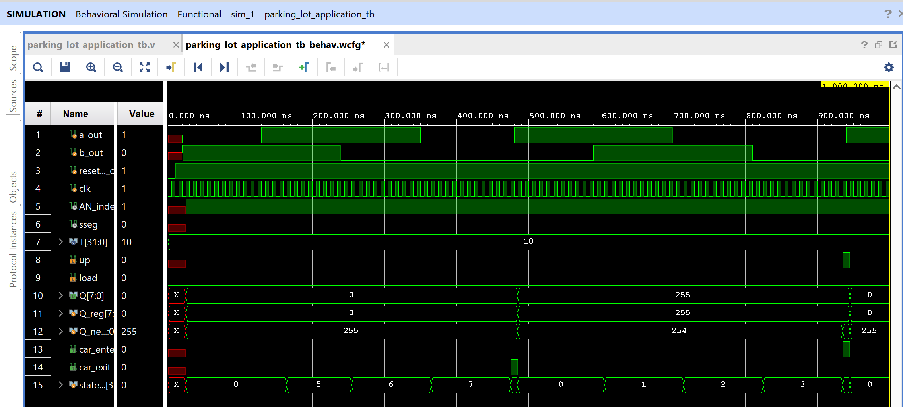

# Lab 8 - Parking Lot Occupancy Counter
## Group 5: Steven Jmaev and Jacob Pollak
### Due Date: April 13, 2021

***
### Lab Goals and User Inputs:
This lab uses a Finite State Machine (FSM) to implement a parking lot occupancy counter. Inputs are three push buttons. User must trigger, then untrigger pushbuttons in correct order to increment or decrement the FSM.

| Button Number | Variable Representation | Button Function | 
| -----------: | -----------: | -----------: |
| CPU_Reset (C12) |   reset_n | Returns Counter to Zero |
| BTNL (P17) |   a | Activates Sensor "a" |
| BTNR (M17) |   b | Activates Sensor "b" |

### Accomplishments:
* Successful implementation on FPGA. 

### Future work: 
* We think this could be expanded to include many inputs for keeping track of vehicles in a parking lot with multiple entrances and exits. 

### Notes for future reference: 
* 

### Feedback from professor:
* Need to have four arrows comming out from each FSM circle. What we did not acount for is if we activate S1 or S5, but stopped. We should stay in the same state.
* Remenber, if you have two inputs; you need four outputs.
* Look into states where returning from a higher state we have a nonasserted value and a dont care. 
* For the sseg_driver, the professor recommmends putting a commparator for the digit values. If larger than 9, activate the 10's digit. If larger than 99, activate 100's digit. 

***

### Lab Assets:

##### Images
###### FSM Diagram:

###### Testbench Simulation:
######  Scenario 1: Unaccounted for car leaves "empty" lot then re-enters space. Wanted to show that the counter wraps back to 255 then increments back to 0.

######  Scenario 2: Car enters then leaves parking lot. Wanted to show that the counter increments to 1, then decrements to 0.

######  Scenario 3: Car begins to enter, but then reverses out and exits. Wanted to show that the code increments through the states of the FSM, but does not increment counter.

##### Video Demonstration:

