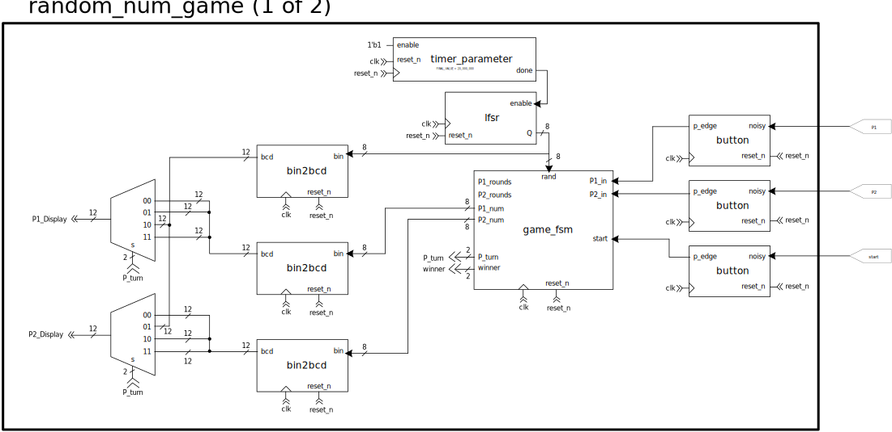
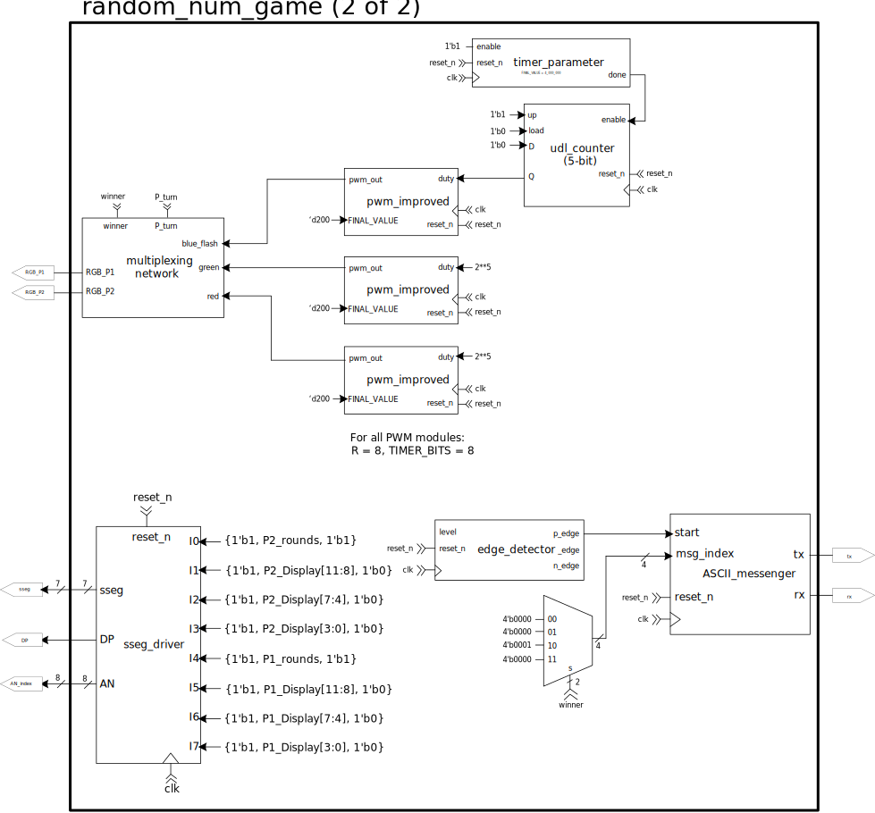
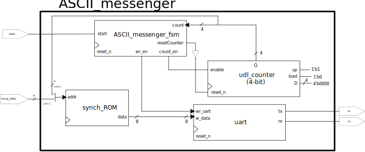
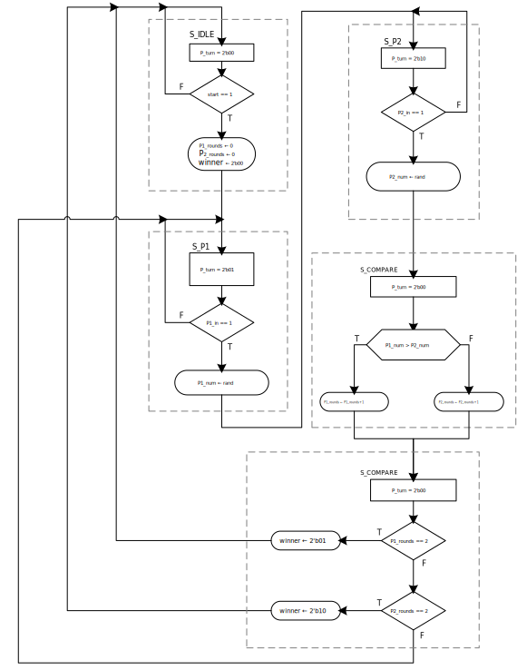
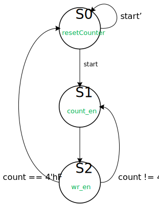
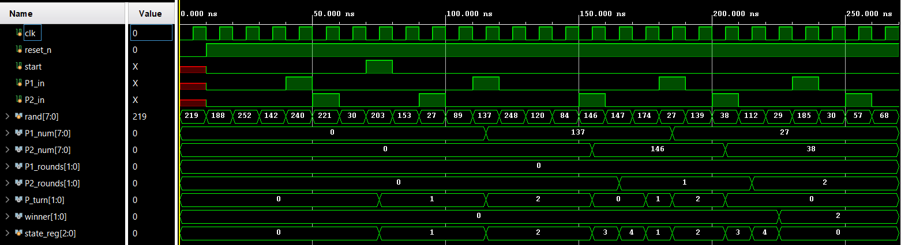
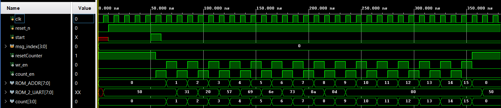
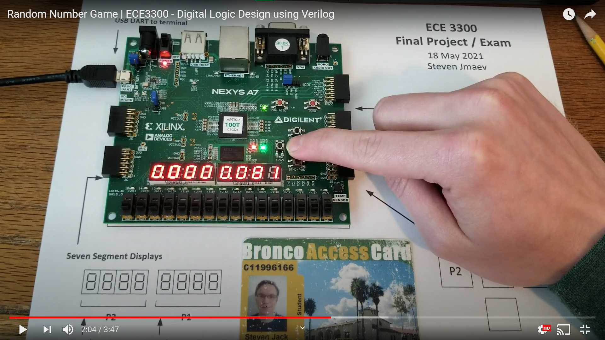

# Final Project / Exam -- Random Number Game
## Steven Jmaev
### Due Date: May 18, 2021

***

Some important descriptions:
When sending messages to be shown on the computer terminal via UART, I created a module called `ASCII_messenger` which reads messages from ROM. These messages are arranged as follows:
* The most significant four bits of the ROM address (bits 7:4) indicate what we call the "message index"
* The least significant four bits of the ROM address (bits 3:0) denote the addresses of each of the characters in the message. 
* With this format, the ROM (whose address is 8 bits long and who stores 8-bit words) can store 2^4 = 16 messages, each containing a maximum of 2^4 = 16 characters.

For example, in this project we stored two different messages in the `messages.mem` file ("P1 Wins\n\r" and "P2 Wins\n\r").
The first message has an index of 0000 while the second message has an index of 0001. Thus, their characters (which are ASCII 8-bit bytes) are stored in memory locations 0000_0000:0000_1111 and 0001_0000:0001_1111, respectively.

There is then a 4-bit counter in this module that selects each of these 16 characters and sends them to the UART module for transmission. 
I hope this makes sense. I'm very proud of this implementation, which is why I make a special note of it here.

### Lab Assets:

##### Images
###### Block Diagrams:

NOTE: These first two block diagrams are not two separate modules. They are the same module, but split into two SVG files for easier viewing, due to its complexity.

rand_num_game diagram:

ASCII_messenger diagram:

###### Finite State Diagrams:
Game FSM Diagram:

ASCII Console Messenger FSM Diagram:

###### Simulation Results:
Game FSM simulation:

Messenger FSM simulation:

##### Video Demonstration:

